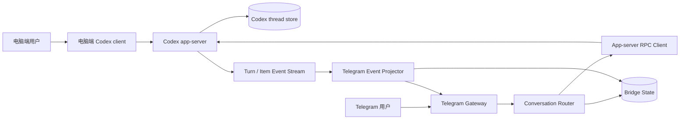
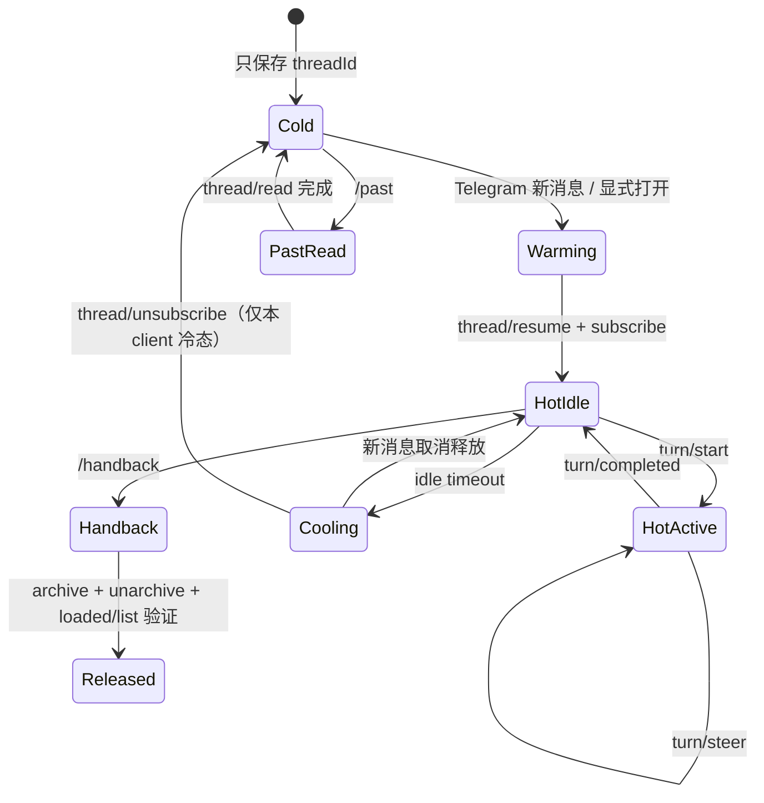
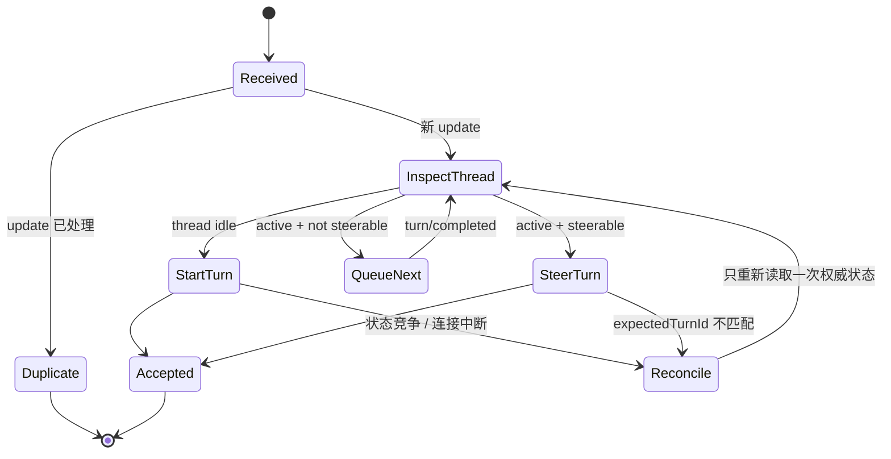

# TeleCodex 技术路线二：共享 Codex app-server 的单 writer 架构

> 状态：提案 / 待原型验证
>
> 日期：2026-08-18
>
> 当前生产基线：技术路线一（TeleCodex + Codex SDK + `codex exec resume`）
>
> 本文目标：定义一条允许电脑端与 Telegram 同时连接同一 Codex 对话的第二技术路线。

> 2026-09-01 implementation note: Codex Desktop still does not join TeleCodex's
> app-server. Production now treats a Desktop `active writer` conflict as a
> compatibility-routing signal: the bridge sends text through Desktop's bundled
> app-tools owner and reads the completed answer back. This `desktop-relay`
> fallback preserves one writer but currently provides final-answer delivery,
> not the full shared-event-stream behavior designed below.
> Writer recognition is runtime-wide rather than bind-only: bind, resume,
> switch, and cold prompt paths inspect the target's exact writer-lock holder,
> require Desktop's bundled app-server PID, then attest the target as
> `idle|active` through that PID's app-tools socket before relaying. CLI and
> shared-app-server writers retain the original conflict instead of being
> guessed into Desktop relay.
>
> 2026-09-01 lifecycle correction: on pinned Codex `0.147.0` and Desktop's
> bundled `0.151.0-alpha.7.2`, `thread/unsubscribe` removes only the requesting
> client's subscription. A real probe showed the thread still present in
> `thread/loaded/list` after three seconds with its writer lock retained.
> Production `/handback` now archive-cycles the idle thread, restores the same
> id as `notLoaded`, and verifies a second app-server can resume it.

## 1. 结论

技术路线二不再让 Telegram 每轮启动一个独立的 `codex exec resume` 进程，而是让一个长期运行的 `codex app-server` 成为 thread 的唯一 owner 和 writer。电脑端与 Telegram 都只是它的 client。

核心拓扑是：

```text
电脑端 client ─┐
               ├── 同一个 codex app-server ── 同一个 thread store
Telegram ──────┘
```

Telegram 收到消息后：

- thread 空闲：调用 `turn/start`，创建正常的用户 turn；
- thread 正在生成且当前 turn 可 steer：调用 `turn/steer`，把消息追加到同一个进行中的 turn；
- thread 正在执行不可 steer 的操作：持久化排队，等待当前 turn 完成后再调用 `turn/start`；
- `thread/inject_items` 只保留给迁移或管理性上下文注入，不用来冒充普通用户消息。

这样消除的是 writer 竞争，不是把冲突藏进重试逻辑。只要 Telegram 仍然另起 `codex exec resume`，桌面端同时打开同一 thread 时就仍可能出现：

```text
thread-store conflict: thread ... already has an active writer
```

## 2. 路线一与路线二

| 维度 | 技术路线一：当前 TeleCodex | 技术路线二：共享 app-server |
| --- | --- | --- |
| Codex 入口 | `@openai/codex-sdk` | app-server JSON-RPC 协议 |
| 每轮执行 | spawn `codex exec ... resume <threadId>` | 向长期运行的 app-server 发送 `turn/start` / `turn/steer` |
| thread writer | 每个 Telegram turn 一个新 CLI 进程 | 一个长期运行的 app-server |
| 桌面与手机同时在线 | 不支持；需要 `/handback` / `/attach` 交接所有权 | 设计目标；多个 client 共享同一 server |
| 生成中追加消息 | Telegram 本地排队，下一 turn 合并 | 优先 `turn/steer` 进入当前 turn；不能 steer 才排队 |
| 状态权威源 | SDK child process + `.telecodex/contexts.json` | app-server thread 状态；本地库只保存路由与投影状态 |
| active-writer conflict | 架构上可能发生 | 同一 app-server 内协调，不启动第二 writer |
| 成熟度 | 已部署基线 | 提案；需先完成共享连接原型 |

路线一仍保留为回退路径。路线二原型通过验收前，不删除 SDK backend、现有 Telegram 队列或 `/handback` 机制。

## 3. 为什么 MCP 不是主控制面

MCP 适合让 Codex 主动调用外部工具，例如读取 Telegram inbox、发送 Telegram 消息或等待新消息。它不适合在 Codex host 空闲时，独立创建一个正常的根用户 turn。

长时间挂起的 `wait_for_telegram` MCP tool 可以模拟“推送”，但 Telegram 输入最终会以 tool result 回到一个已经存在的 turn，而不是用户消息。这会带来三个问题：

- 对话语义错误：手机消息被记录成工具返回值；
- 生命周期错误：必须先有一个 Codex turn 持续等待；
- UI 与恢复错误：桌面历史、用户 turn、失败重试都不再自然。

因此路线二的职责分工是：

- app-server：conversation control plane，负责 thread、turn、writer 与事件；
- MCP：可选的 tool plane，继续承担 Telegram 发文件、读 inbox 或其他工具能力；
- Telegram adapter：app-server client，不是第二个 Codex writer。

## 4. 目标架构



### 4.1 Codex app-server

职责：

- 唯一加载和持有目标 thread；
- 接受多个 client 的连接与初始化握手；
- 执行 `thread/start`、`thread/resume`、`turn/start`、`turn/steer`；
- 持久化 Codex thread 与 turn；
- 广播 turn、item、agent message、tool progress 和完成事件；
- 统一执行模型、cwd、sandbox 与 approval 配置。

推荐部署为独立 launchd 服务。Telegram bridge 重启不应连带终止 app-server，电脑端退出也不应销毁 thread owner。

本机连接优先使用 Unix socket；不把 app-server 直接暴露到公网。这里的 Unix transport 仍是 WebSocket framing（经标准 HTTP Upgrade），不是裸 JSONL；只有 stdio transport 使用逐行 JSON。官方也支持 TCP `ws://` listener，但该传输当前仍标记为 experimental，不作为首选部署边界。

### 4.2 电脑端 client

路线二分为两个落地层级：

1. **Phase A：Codex CLI TUI**
   - 官方明确支持 `codex --remote <endpoint>` 连接已有 app-server；
   - 电脑 CLI 和 Telegram adapter 可以确定地连接同一个 server；
   - 这是路线二第一个必须做通的闭环。
2. **Phase B：Codex Desktop App**
   - 需要验证 Desktop 是否暴露可复用的 app-server control socket，或是否允许它连接外部 app-server；
   - 当前不能把这项写成既成事实；
   - 若 Desktop 的内部 app-server 不对外开放，路线二仍能支持电脑 CLI + Telegram，但不能直接绑定 Desktop 当前持有的 thread；
   - 真正接入 Desktop 将需要宿主侧扩展、官方连接入口，或让 Desktop 也改为共享 daemon 的 client。

### 4.3 Telegram Gateway

继续复用当前 TeleCodex 的表现层能力：

- 单一 bot token polling consumer；
- Telegram user/chat allowlist；
- 现有代理与 API base 配置；
- typing、流式编辑、附件、语音和产物回传；
- launchd 守护、日志与失败重启。

同一个 bot token 不得同时由路线一和路线二 polling。backend 切换必须先停旧 consumer，再启动新 consumer。

### 4.4 Conversation Router

Router 将 Telegram context 映射到 Codex thread，并根据 app-server 的实时状态选择操作。

建议保存以下数据：

```text
TelegramContextKey -> threadId
Telegram update_id / message_id -> delivery state
threadId -> observed activeTurnId / status / last event cursor
Codex itemId / turnId -> Telegram projected message ids
pending inbox messages
pending outbox edits and sends
```

`.telecodex/contexts.json` 可以继续承载早期原型，但它不再是 thread 状态的权威源。正式实现建议迁到 SQLite，以便事务化处理 Telegram update 去重、pending inbox 和 outbox 恢复。

### 4.5 多 thread 的 lazy-resume 与 idle-release

“保存多条对话”不等于“同时加载多条对话”。路线二把 thread 分成两层：

- **持久层**：保存多个 `threadId`、各自的 rollout JSONL 和 SQLite 元数据；
- **运行层**：app-server 只加载当前正在使用或仍有 subscriber 的 thread。

一个 app-server 进程可以管理多个 loaded thread。它不是为每条 thread 启动一个 Codex 进程，也不要求 Telegram bridge 永久打开所有 rollout JSONL。具体文件句柄与落盘由 Codex thread store 管理；bridge 只持有 thread id、订阅和投影状态。

官方 app-server API 已提供与此模型对应的生命周期：

- `thread/loaded/list`：查看当前加载到内存的 thread；
- `thread/resume`：按 id 重新加载持久化 thread，并用于后续 `turn/start`；
- `thread/unsubscribe`：当前 client 放弃该 thread 的事件订阅；
- `thread/unsubscribe` 不保证 unload resident thread；当前本机版本会继续持有 writer lock。
- `thread/archive` 会 unload resident thread；紧接 `thread/unarchive` 可把同一 id 恢复为 `notLoaded`，这是当前跨 app-server handback 的兼容路径。

Router 不应在启动时 resume `.telecodex/contexts.json` 中的全部 thread。推荐使用按需租约：



释放条件应同时满足：

- 没有 active turn；
- 没有 pending Telegram inbox；
- 没有未完成的 Telegram outbox 投影；
- 没有待响应的 app-server request；
- 最近一次输入或事件已经超过可配置 idle timeout。

默认行为固定为混合生命周期，不让用户在 Lazy 与 Watch 两种模式之间选择：

- **热态 watch**：thread 被 resume 后，Telegram bridge 保持订阅并实时投影电脑端和 Telegram 端事件；
- **60 分钟闲置租约**：从 `turn/completed` 或最后一次有效用户输入开始计时，用于覆盖边做其他事边聊天的长停顿；普通 delta 不反复续租，active turn 本身禁止释放；
- **冷态 release**：租约到期且满足全部释放条件后，bridge 调用 `thread/unsubscribe`，只停止本 client 的事件订阅；当前 app-server 仍可能保留 resident thread 和 writer；
- **跨进程 handback**：只允许 idle thread；执行 `thread/archive` → `thread/unarchive`，再用 `thread/loaded/list` 确认 writer 已释放。任何一步失败都不得清空 Telegram 绑定或宣告成功；
- **冷态恢复聊天**：收到新的普通 Telegram 消息时先 `thread/resume`、订阅并对账，再执行 `turn/start` 或 `turn/steer`；
- **冷态补历史**：执行 `/past` 时只读取持久化历史，不 resume、不订阅，也不续 60 分钟租约。

Telegram bridge 冷态时不会实时收到只从电脑端新发起的 turn，但这些内容仍在 Codex thread 的持久化历史中，由 `/past` 补发。这里的差异只是实时投影与事后补读的方式，不是功能能否实现。

#### `/past` 冷读补发

`/past` 是 Telegram bridge 的本地控制命令，不能作为普通用户消息送入 Codex thread。

历史读取按以下优先级实现：

1. **首选 `thread/read`**：传入 `includeTurns: true`，读取持久化 thread 的完整 turn 历史。官方接口明确说明该调用不会 resume thread，适合冷态补读。
2. **可选分页接口**：长对话需要降低单次读取量时，可试用 `thread/turns/list` 或 `thread/items/list`；这两个接口当前属于 experimental，不能作为唯一实现。
3. **JSONL fallback**：官方接口不可用、版本行为不兼容或 app-server 无法读取时，按 `threadId` 定位 rollout JSONL，由版本化 parser 提取 user/assistant item。

请求示例：

```json
{
  "method": "thread/read",
  "id": 40,
  "params": {
    "threadId": "thr_123",
    "includeTurns": true
  }
}
```

每个 `TelegramContextKey + threadId` 保存独立的 `lastTelegramWatermark`，至少包含最后一个成功投影的 Codex `turnId` / `itemId`。只有 Telegram `sendMessage` 或最终 `editMessage` 成功后才推进 watermark；发送失败不能提前标记为已投影。

`/past` 的输出规则固定为：

- 读取 watermark 之后尚未在 Telegram 成功展示的完整内容；
- 取最近最多 5 个完整 turns，再按时间正序排列；
- 总输出最多 1000 字，超过时截断并标明还有更早内容未展示；
- 包含缺失的电脑端用户输入和 assistant 回复，格式示例为 `你（电脑）：…` / `Codex：…`；
- Telegram 原生聊天中已经存在的 Telegram 用户输入不重复补发；
- 补发成功后将 watermark 推进到本次最后一个已展示 item；
- 纯 `/past` 完成后仍保持 Cold。

JSONL fallback 只读取完整行。若 rollout 正在追加，parser 可以忽略 EOF 处唯一一个未完成的末行，但不能吞掉中间的解析错误。parser 需要按 Codex 版本保存 fixture 测试，因为 rollout JSONL 是内部存储格式，不具备 app-server API 的兼容性承诺。

## 5. 输入路由状态机



### 5.1 idle：`turn/start`

Router 向已加载的 thread 发送正常用户输入：

```json
{
  "method": "turn/start",
  "id": 30,
  "params": {
    "threadId": "thr_123",
    "input": [{ "type": "text", "text": "Telegram message" }]
  }
}
```

路线二默认不在每一条 Telegram 消息上覆盖 model、cwd、sandbox 或 approval。官方说明 turn 级覆盖会成为该 thread 后续 turn 的默认值；共享 thread 的执行策略应由 app-server 启动配置统一拥有，不能由某个 client 悄悄改写。

### 5.2 active：`turn/steer`

当 thread 有可 steer 的 active turn 时：

```json
{
  "method": "turn/steer",
  "id": 31,
  "params": {
    "threadId": "thr_123",
    "expectedTurnId": "turn_456",
    "input": [{ "type": "text", "text": "补充：先看日志" }]
  }
}
```

`expectedTurnId` 是并发前置条件。若不匹配，说明 Router 看到的状态已经过期；正确处理是重新读取 thread 状态并重新分类一次，而不是盲目重试同一个 steer。

`turn/steer` 不接受 model、cwd、sandboxPolicy 或 outputSchema 覆盖，也不会产生新的 `turn/started`。Telegram projector 必须把这条输入关联到现有 turn。

### 5.3 active 但不可 steer：持久化排队

review、compact、interrupt 窗口或某些特殊 turn 可能不可 steer。此时：

1. 将 Telegram update 事务化写入 pending inbox；
2. 向用户保持静默或只显示 typing，不发送技术错误；
3. 收到 `turn/completed` 后按 Telegram message 顺序合并；
4. 使用一个新的 `turn/start` 发送；
5. 只有 app-server 明确接受后才标记 delivered。

现有路线一的“忙时消息合并”逻辑可以复用为这一分支的降级机制。

### 5.4 `thread/inject_items` 的边界

`thread/inject_items` 会向 model-visible history 追加原始 Responses API item，但不会启动用户 turn。它适合：

- 迁移外部历史；
- 恢复经过验证的预计算上下文；
- 管理性修复。

它不用于 Telegram 普通聊天、不用于绕过 `turn/start` 的状态机，也不用于伪造桌面端用户消息。

## 6. 输出投影与跨端可见性

Telegram adapter 订阅绑定 thread 的事件：

- `turn/started`：建立 turn 与 Telegram message 的关联；
- `item/agentMessage/delta`：节流编辑 Telegram 草稿消息；
- `item/completed`：提交该 item 的稳定内容；
- `turn/completed`：停止 typing，提交最终消息，释放 pending inbox；
- thread status 变化：更新 Router 的权威状态缓存。

跨端投影规则：

- Telegram 发出的用户消息已经存在于 Telegram，不重复发送；
- 热租约期间，电脑端发出的用户消息投影成一条轻量提示，例如 `你（电脑）：…`，保证手机历史可读；
- 热租约期间，无论 turn 从电脑还是 Telegram 发起，assistant 输出都实时投影到 Telegram；
- 冷态期间从电脑端产生但未实时投影的用户输入和 assistant 回复，由 `/past` 根据 watermark 补发；
- 电脑 client 通过同一个 app-server 事件流看到 Telegram 发起的 turn 和回复；
- tool 细节默认不投影，只保留用户可读进度和最终结果。

Bot API 无法把电脑端输入伪装成 Telegram 用户本人发送的原生消息，因此“电脑端用户消息如何显示”是表现层选择，不影响共享 thread 的模型历史。

## 7. 并发、幂等与故障恢复

### 7.1 单 writer 不等于无竞争

app-server 是唯一 thread writer，但多个 client 仍可能同时请求新 turn。Router 必须接受 optimistic concurrency：

- 以 app-server 返回状态为准；
- `turn/start` 与桌面输入撞车时，重新读取状态后选择 steer 或排队；
- `turn/steer` 只对匹配的 `expectedTurnId` 生效；
- `active writer` 错误在路线二中应被视为拓扑违规：说明还有第二个 Codex 进程碰了同一 store，不能靠重试掩盖。

### 7.2 Telegram 入站幂等

每个 Telegram update 先落库，再调用 app-server。唯一键至少包含 bot identity 与 `update_id`。状态建议为：

```text
received -> dispatching -> accepted -> projected
                   \-> retryable
                   \-> dead_letter
```

进程在“RPC 已接受、数据库尚未更新”之间崩溃时，不能无条件重发。恢复流程先通过 `thread/read`、turn/item 内容或已记录的 request correlation 判断是否已经进入 thread。

### 7.3 app-server 重启

- client 断线后指数退避重连；
- 完成 initialize/initialized 握手；
- 对绑定 thread 执行 `thread/resume` 并重新订阅；
- 使用 `thread/read(includeTurns=true)` 对账最后一个 turn；
- 先修复 Telegram 投影，再继续派发 pending inbox；
- 不另外启动 `codex exec resume` 作为“临时恢复”。

### 7.4 Telegram bridge 重启

bridge 与 app-server 分离部署。bridge 重启后：

- app-server 和 active turn 继续运行；
- bridge 恢复连接并读取 thread 状态；
- 若错过 delta，直接从已完成 item 重建最终 Telegram 消息；
- pending inbox/outbox 从本地事务库恢复。

## 8. 权限模型

### 8.1 当前全局默认

本机 `~/.codex/config.toml` 已设置：

```toml
sandbox_mode = "danger-full-access"
approval_policy = "never"
```

这会让以后新启动的 Codex CLI / app-server 默认不使用命令沙箱，也不暂停等待命令审批。已有进程需要重启才会读取新默认。

路线二推荐让 app-server 从这一全局配置继承权限，不在 Telegram 的每个 `turn/start` 上重复覆盖。原因是 turn 级 override 会改变同一 thread 的后续默认，破坏“策略属于共享 server，而不是某个 client”的边界。

如果以后需要把其他 Codex CLI 恢复为较低权限，应改为单独的 `$CODEX_HOME/<profile-name>.config.toml`，由 app-server 启动时用 `--profile <profile-name>` 选择，而不是让 Telegram adapter 每轮写策略。

### 8.2 风险不是抽象的

在 `danger-full-access + never` 下，Telegram bot token、allowlist 身份和 Telegram 账号共同构成这台 Mac 的远程代码执行边界。Telegram 账号或 bot token 被接管，攻击者可能以 Codex 可见用户权限读取、修改或删除本机数据。

因此最低要求是：

- app-server 只监听本机 Unix socket，不直接暴露公网；
- Telegram 使用精确 user id + chat id allowlist；
- bot token 不进入仓库、日志或命令行参数；
- token/config 文件权限收紧；
- 保留本机一键停用 launchd 服务的 kill switch；
- 路线一与路线二不能同时消费同一 bot token；
- 记录 Telegram update、Codex turn 和高风险 tool action 的关联审计信息；
- destructive action 的业务约束仍由 Codex instructions / rules 承担，`approval_policy = "never"` 不代表删除这些约束。

## 9. 部署拓扑

建议拆成两个 launchd service：

```text
com.example.telecodex.shared-app-server
  └─ codex app-server --listen unix://<local-socket>

com.example.telecodex.app-server-bridge
  └─ Telegram Gateway + Router + Event Projector
       └─ connect unix://<same-local-socket>
```

电脑 CLI 连接同一个 endpoint：

```bash
codex --remote unix://<same-local-socket>
```

启动顺序：

1. app-server 启动并创建 socket；
2. health probe 完成 initialize 握手；
3. Telegram bridge 连接、resume 已绑定 thread、完成状态对账；
4. Telegram polling 才开始消费新 update；
5. 电脑 client 可随时连接或退出，不改变 app-server 所有权。

## 10. 实施切分

### Phase 0：验证核心假设

- 启动独立 app-server，并使用本地 socket；
- 用 `codex --remote` 作为电脑端 client；
- 编写最小 Telegram/RPC probe，连接同一个 server；
- 证明两个 client 能订阅同一 thread；
- 证明 idle 消息使用 `turn/start`；
- 证明生成中 Telegram 消息使用 `turn/steer`；
- 证明任意一端退出不会出现 active-writer conflict；
- 检查 Codex Desktop App 的进程、socket 与连接能力，给 Phase B 明确 go/no-go 结论。

Phase 0 不迁移生产 bot，不替换路线一。

### Phase 1：抽象 backend

在 TeleCodex wrapper 中建立稳定接口：

```ts
interface ConversationBackend {
  attach(threadId: string): Promise<void>;
  submit(input: UserInput): Promise<AcceptedInput>;
  subscribe(handler: ConversationEventHandler): Unsubscribe;
  readState(): Promise<ThreadState>;
  interrupt(turnId: string): Promise<void>;
}
```

保留两个实现：

- `ExecSdkBackend`：路线一；
- `AppServerBackend`：路线二。

Telegram UI、allowlist、附件和流式输出不直接依赖某个 backend。

### Phase 2：可靠消息与投影

- SQLite inbox/outbox；
- Telegram update 幂等；
- turn/item 到 Telegram message 的映射；
- 每个 Telegram context/thread 的成功投影 watermark；
- delta 节流、重连补投影；
- `/past` 的 `thread/read(includeTurns=true)` 冷读与 5 turns / 1000 字裁剪；
- rollout JSONL fallback parser 与版本 fixture；
- active-but-not-steerable 队列；
- tool request / user input request 的 Telegram 交互。

### Phase 3：电脑 CLI + Telegram 灰度

- 新 bot backend 只绑定一个测试 thread；
- 压测连续消息、电脑/手机交替输入和同时输入；
- 验证 app-server 与 bridge 分别重启；
- 验证全局 `danger-full-access + never` 在新进程生效；
- 达标后再把生产 bot token 从路线一切到路线二。

### Phase 4：Desktop App 接入判定

若 Desktop 能连接共享 app-server，完成 Desktop adapter 与端到端验收。若不能：

- 将“电脑端”正式定义为 `codex --remote` TUI；或
- 等待/采用官方 Desktop host 接口；或
- 单独设计宿主扩展。

不能用第二个 `codex exec resume` 冒充 Desktop 接入，因为那会重新引入路线二要消除的 writer 冲突。

## 11. 验收标准

路线二只有同时满足以下条件才可替换路线一：

- 电脑 CLI 与 Telegram 同时连接同一个 app-server、同一个 thread；
- 连续 100 个交替 turn 不出现 `active writer` / thread-store conflict；
- thread idle 时 Telegram 输入形成正常的新用户 turn；
- thread active 时 Telegram 输入能通过 `turn/steer` 进入正确 turn；
- 不可 steer 时消息不丢失、不重复，并在完成后按顺序进入下一 turn；
- 电脑发起的 assistant 输出能投影到 Telegram；
- Telegram 发起的 turn 能在电脑 client 中看到；
- bridge 重启不终止 active turn，恢复后能补齐最终输出；
- app-server 重启后能 resume thread 并对账，不启动第二 writer；
- thread 完成后保持 60 分钟热态 watch，满足释放条件后 unsubscribe 并进入本 client 冷态；
- `/handback` 完成后同一 thread id 不在 shared app-server 的 loaded 集合，第二个 app-server 能立即 resume；
- 冷态 `/past` 不 resume thread、不续热租约，并能补发 watermark 后最近最多 5 turns / 1000 字；
- `/past` 只有在 Telegram 发送成功后才推进 watermark，重复调用不重复展示已经确认投影的内容；
- 官方历史接口不可用时，JSONL fallback 能从测试 fixture 生成相同的用户/assistant 消息序列；
- Telegram update、Codex turn、Telegram output 三者可追踪；
- 新 app-server 确认加载 `danger-full-access + approval_policy=never`；
- bot token、allowlist、socket 和日志通过最小安全检查；
- 路线一仍可在停止路线二 consumer 后人工回退。

Desktop App 的验收单独计算。电脑 CLI + Telegram 达标，不自动证明 Desktop App + Telegram 达标。

## 12. 关键决策与未决问题

已经确定：

- thread 只能有一个 app-server writer；
- Telegram 不再 spawn `codex exec resume`；
- 普通消息使用 `turn/start` / `turn/steer`；
- `thread/inject_items` 不是普通聊天入口；
- app-server 与 Telegram bridge 分离守护；
- 全局 Codex 新进程默认 `danger-full-access + never`；
- 默认采用“热态 watch 60 分钟、冷态自动 release”的混合生命周期，不暴露 Lazy/Watch 模式选择；
- `/past` 首选 `thread/read(includeTurns=true)` 冷读，必要时降级解析 rollout JSONL；
- `/past` 以成功投影 watermark 为边界，最多补发最近 5 turns / 1000 字；
- 路线一保留到路线二完整验收。

必须通过原型回答：

- Codex Desktop App 能否接入同一个 app-server control socket？
- 多 client 对同一已加载 thread 的订阅与事件广播具体行为如何？
- client 断线后哪些事件可重放，哪些必须通过 `thread/read` 重建？
- active turn 的可 steer 状态应依赖哪一个稳定字段或错误码？
- app-server daemon / proxy 在当前 Codex 版本中的稳定性是否足够，还是应直接由 launchd 管理单一 server 进程？
- tool approval、`tool/requestUserInput` 等 server request 在多个 client 同时在线时由谁响应？
- 电脑端用户消息在 Telegram 中采用何种最小干扰的投影格式？

## 13. 官方依据

- [Codex App Server](https://developers.openai.com/codex/app-server/)：app-server 定位、transport、remote CLI、thread/turn 生命周期、`turn/start`、`turn/steer`、`thread/read`、实验性分页历史接口、`thread/inject_items` 与事件流。
- [Codex Configuration Reference](https://developers.openai.com/codex/config-reference/)：`sandbox_mode`、`approval_policy` 与 profile file。
- [Codex CLI command reference](https://developers.openai.com/codex/cli/reference/)：`--remote`、`--profile`、`--sandbox danger-full-access` 与 `--dangerously-bypass-approvals-and-sandbox`。
